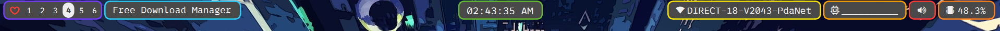
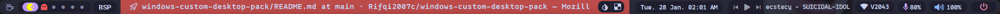

# These repo was made for personal use so you might have fix few things if it didnt work well on your computer

# yasb bar and terminal font (make sure to install this first)
* [0xproto Nerd Font](https://github.com/ryanoasis/nerd-fonts/releases/download/v3.2.1/0xProto.zip)

# [komorebi](https://github.com/LGUG2Z/komorebi)
* [komorebi.json](https://github.com/Rifqi2007c/windows-custom-desktop-pack/blob/main/komorebi.json) (this config is for two monitor setup)

# [yasb bar](https://github.com/da-rth/yasb)

* [config.yaml](https://github.com/Rifqi2007c/windows-custom-desktop-pack/blob/main/.yasb/config.yaml)
* [styles.css](https://github.com/Rifqi2007c/windows-custom-desktop-pack/blob/main/.yasb/styles.css)

# [yasb bar reborn](https://github.com/amnweb/yasb)

* [config.yaml](https://github.com/Rifqi2007c/windows-custom-desktop-pack/blob/main/yasb%20reborn/config.yaml)
> this config was made for dual monitor (1 horizontal 1 vertical) if you only have one monitor remove these lines
> ```
> status-bar-2:
>    screens: ['\\.\DISPLAY2'] 
>    class_name: "yasb-bar"
>    alignment:
>      position: "top"
>      center: false
>    animation:
>      enabled: true
>      duration: 1000
>    blur_effect:
>      enabled: false
>      acrylic: false
>      dark_mode: false
>      round_corners: false
>      round_corners_type: "normal"
>      border_color: "System"
>    window_flags:
>      always_on_top: false
>      windows_app_bar: true
>    dimensions:
>      width: "100%"
>      height: 28
>    padding:
>      top: 4
>      left: 6
>      bottom: 0
>      right: 6
>    widgets:
>      left: ["home","komorebi_workspaces","komorebi_active_layout","active_window"]
>      center: []
>      right: ["clock","microphone","volume","power_menu"]
> ```
* [style.css](https://github.com/Rifqi2007c/windows-custom-desktop-pack/blob/main/yasb%20reborn/styles.css)
   - [pywal/winwal](https://github.com/scaryrawr/winwal)
   - script
      - [change bar color](https://github.com/Rifqi2007c/windows-custom-desktop-pack/blob/main/yasb%20reborn/yasbc.ps1)
      - [change bar + terminal color](https://github.com/Rifqi2007c/windows-custom-desktop-pack/blob/main/yasb%20reborn/yasbc%2Bterminal.ps1)
> the script need to be run normally (or you can use flow launcher) first before you can use the button on the bar

# [flow launcher](https://www.flowlauncher.com/)
* Theme
    - [violet](https://github.com/eliaszon/Violet.flow)
    - [catppuccin](https://github.com/catppuccin/flow-launcher) 

# Terminal
* [windows terminal](https://github.com/microsoft/terminal)
   - [settings.json](https://github.com/Rifqi2007c/windows-custom-desktop-pack/blob/main/settings.json)
* [wezterm](https://wezfurlong.org/wezterm/index.html)
   - [.wezterm.lua](https://github.com/Rifqi2007c/windows-custom-desktop-pack/blob/main/.wezterm.lua)

# [winfetch](https://github.com/lptstr/winfetch)
* [my custom winfetch](https://github.com/Rifqi2007c/winfetch-custom-theme)

# [neofetch](https://github.com/dylanaraps/neofetch)(wsl)
* [config.conf](https://github.com/Rifqi2007c/windows-custom-desktop-pack/blob/main/config.conf)

# [cava](https://github.com/karlstav/cava)(wsl with winscap)
* [config](https://github.com/Rifqi2007c/windows-custom-desktop-pack/blob/main/config)
* [winscap](https://github.com/quantum5/winscap)
  - [guide on how to use cava(wsl) with winscap](https://www.youtube.com/watch?v=Sp1Qjdqt4TQ&list=WL&index=1&t=77s)(by José Rodolfo)

# .ps1 script for changing wallpaper
* [script](https://github.com/I-Am-Jakoby/PowerShell-for-Hackers/blob/main/Functions/Set-WallPaper.md)(by I am Jakoby)
* [guide](https://www.youtube.com/watch?v=N1Vdkd7P_cM)(by I am Jakoby)

# windows theme and custom cursor
* Theme : [One Dark Pro](https://www.deviantart.com/niivu/art/One-Dark-Pro-for-Windows-11-930312689)
* cursor
    - [catppuccin(mocha rosewater)](https://www.deviantart.com/niivu/art/Catppuccin-Cursors-921387705)
    - [windows 11 concept cursor](https://www.deviantart.com/jepricreations/art/Windows-11-Cursors-Concept-886489356)

# task bar (I use windhawk for custom taskbar)
* enable automatically hide the task bar in settings
* [ExplorerPatcher](https://github.com/valinet/ExplorerPatcher)
* [StartAllBack](https://www.startallback.com/) (I use StartAllBack)
* [TaskbarXI](https://github.com/ChrisAnd1998/TaskbarXI) (windows 11 only)

# [windhawk mod](https://windhawk.net)
* Classic context menu on windows 11
* Taskbar height and icon size
* Taskbar Volume Control
* Windows 11 Start Menu Styler
* Windows 11 Taskbar Styler

# extra
* [my wallaper folder](https://drive.google.com/drive/folders/1GuL6vkfVSh4UMI_UacVN7z4jhkNDJDlW?usp=drive_link)
* VScode theme : Tomorrow Night Blue
* [my firefox css](https://github.com/Rifqi2007c/firefox-css)
